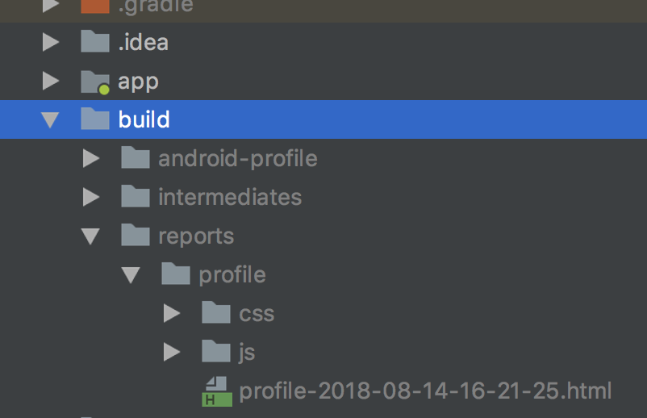

##Android下的Gradle

### 一、基本结构

---
&nbsp;&nbsp;&nbsp;&nbsp;新建一个Android工程，然后在`Project View`中以`Android`模式查看：

<div align="left">

<div/>


#### <font color="green">1.build.gradle </font>

Android工程是Gradle下的`multi-projects`模式，它有一个`Top-Level`的`build.gradle`文件，一个子目录`app`也有它自己的`build.gradle`文件。最顶层的`build.gradle`被标记了`(Project: HelloWorld)`,而`app`下的`build.gradle`文件标记了`(Module: app)`.

#### <font color="brown">2.gradle.properties</font>

你可能还会看到两个`gradle.properties`文件，一个是针对你当前工程的本地文件，另一个呢，在你电脑根目录下的`.gradle`目录下会有一个相同名字命名的全局`gradle.properties`文件（可选性）。

#### <font color="green">3.settings.gradle</font>

用于配置`multi-project`构建结构，初始化的工程应该只有如下一行：

```
include ':app'
```
这行代码告诉Gradle`app`目录也是一个Gradle工程，随后我们可能会添加一些Library到主工程下，新添加的目录也会被追加到这个文件中。


#### <font color="brown">4.gradle-wrapper.properties</font>

用来配置所谓的`Gradle Wrapper`,它允许你去构建Android工程的时候不必先安装Gradle，它的文件结构：

```
#Thu Jul 26 18:56:17 CST 2018
distributionBase=GRADLE_USER_HOME
distributionPath=wrapper/dists
zipStoreBase=GRADLE_USER_HOME
zipStorePath=wrapper/dists
distributionUrl=https\://services.gradle.org/distributions/gradle-4.1-all.zip

```
4行配置信息表示GradleWrapper第一次运行的时候，它回去下载Gradle发布版本然后存储在电脑主目录下的`.gradle/wrapper/dists`路径下。
最后一行`distributionUrl`的值表示下载Gradle的路径。

>`distributionUrl`的URL值可能会指向一个`binary version`(-bin),也可能会是一个完整版本的包（-all）。


### 二、主工程的build.gradle

主工程的`build.gradle`大概长这个样子：

```groovy
// Top-level build file where you can add configuration options common to all sub-projects/modules.

buildscript {	----> A
    
    repositories {	
        google()
        jcenter()//默认Android的Gradle插件从jcenter下载
    }
    dependencies {	----> B
        classpath 'com.android.tools.build:gradle:3.0.1'
        

        // NOTE: Do not place your application dependencies here; they belong
        // in the individual module build.gradle files
    }
}

allprojects {	----> C
    repositories {//主工程和所有子工程下载依赖的地址
        google()
        jcenter()
    }
}

task clean(type: Delete) {	----> D
    delete rootProject.buildDir
}
```

> A:下载插件<br>
> B:标识Android插件<br>
> C:配置顶层的Module<br>
> D:临时任务<br>

#### 1.`buildscript`

Gradle定义了DSL（domain-specific language）来构建项目。`buildscript`标签是DSL的一部分，它告诉Gradle本次构建需要的一个Plugin可能不包含在Gradle发布的基准包里，然后告诉Gradle到哪里去找这个Plugin,在这种情况下，寻找Plugin还需要预先约束好一种语法“group:name:version”,示例的“group”是:`com.android.tools.build`,"name"是：`gradle`,"version"是：`3.0.1`.
> Gradle的发布版本默认不会包含Android的功能，只是提供了Plugin
当Gradle第一次构建这个项目的时候，配置的Plugin都会被下载然后缓存，所以这个task只会被执行一次。

#### 2.`allprojects`

`allprojects`的详细配置会应用到主工程和主工程下的所有子工程，在示例中，代码块中的配置要求所有的依赖都会去`google()`和`jcenter()`去下载。


#### 3.其他

最后还有一个自定义的TASK，名字是`clean`,它使用的是内置的`Delete`属性，`clean`任务会把`rootProject`下的`buildDir`删除掉，这两个都是项目下的具体属性，它们的默认值也是应用所在项目中的具体目录。


### 三、app工程的build.gradle


#### 1.Plugin

---
打开app工程下的`build.gradle`文件,第一行就是：

```
apply plugin: 'com.android.application'
```

为当前工程`apply`一个Android的`Plugin`，通常情况下，一个JAVA项目会添加`java`的Plugin，但是Android项目使用`com.android.application`,除此之外还有`apply from`等写法引入别的gradle文件。
#### 2.android

---
在Gradle中，允许Plugin为一个Gradle工程添加自定义Task、配置项、依赖项和其他功能，在这种情况下，Android工程就可以添加一个Android的插件然后添加各种任务，`android`就是Android DSL 的入口：

```groovy
android {
    compileSdkVersion 27
    defaultConfig {
        applicationId "hello.com.helloworld"
        minSdkVersion 15
        targetSdkVersion 27
        versionCode 1
        versionName "1.0"
        testInstrumentationRunner "android.support.test.runner.AndroidJUnitRunner"
    }
    
    compileOptions{
        sourceCompatibility JavaVersion.VERSION_1_7
        targetCompatibility JavaVersion.VERSION_1_7
    }
    
    buildTypes {
        release {
            minifyEnabled false
            proguardFiles getDefaultProguardFile('proguard-android.txt'), 'proguard-rules.pro'
        }
    }
}
```
这些配置项更多的是和Android相关，和Gradle自身的系统关联并不多，然后简述一下：

> * `compileSdkVersion`指定的是AndroidSDK的版本，建议使用最新的稳定版本
> * `defaultConfig`配置的属性是被APP工程Android变体（Android variants）共享的部分
> * `applicationId`基于域名和项目名称指定，必须唯一。
> * `minSdkVersion `是你想支持的最小Android版本，而`targetSdkVersion`也应该是最新的Android可用版本
> * `versionName`和`versionCode`用于个人控制版本更新
> * `testInstrumentationRunner`用来配置Junit4
> * `compileOptions`表示当前应用期望用JAVA 1.7版本

紧接着的一段配置是`buildTypes`，Android默认支持`debug`和`release`两种形式，在这里你可以配置你需要的其他形式，`debug`默认是不显示的，也就是说默认的统一配置就是`debug`。

#### 3. dependencies

在`android`区块下，有一个区域显示了当前`app`需要个各种`libraries`。

```
dependencies {
    implementation fileTree(dir: 'libs', include: ['*.jar'])
    implementation 'com.android.support:appcompat-v7:27.1.1'
    implementation 'com.android.support.constraint:constraint-layout:1.1.2'
    testImplementation 'junit:junit:4.12'
    androidTestImplementation 'com.android.support.test:runner:1.0.2'
    androidTestImplementation 'com.android.support.test.espresso:espresso-core:3.0.2'
}
```
配置依赖项是构建`Gradle`应用的基本步骤,而添加依赖的语法是固定的`（group:name:version）`。基于此，`dependencies `部分用到的配置选项有`implementation`,`testImplementation`,`androidTestImplementation`等。
先拿一个最简单的来说，`testImplementation`依赖项就是`Junit4`发布的最新的稳定版，保证在`JUint`的`class`文件和测试注解在`src/test/java`目录下可用。<br>
然后`androidTestImplementation`引用的是`Espresso`的测试库。<br>

最后还有三行`implementation`配置的信息：
> * `fileTree(dir: 'libs', include: ['*.jar'])`将`libs`下所有的`jar`文件添加到的`classpath`以供编译
> * `com.android.support:appcompat-v7:27.1.1`，Android兼容包，以便使用MD主题。
> * `com.android.support.constraint:constraint-layout:1.1.2`提供使用`ConstraintLayout`。

### 四、执行Gradle任务

通过AS可用很方便的部署一个debug的应用，但是它背后的Gradle是复杂的，我们可以打开终端，并执行`./gradlew build`来看一下输出：

```
➜  HelloWorld ./gradlew build

> Configure project :

> Configure project :app
NDK is missing a "platforms" directory.
If you are using NDK, verify the ndk.dir is set to a valid NDK directory.  It is currently set to /Users/lihua/SoftWare/sdk/ndk-bundle.
If you are not using NDK, unset the NDK variable from ANDROID_NDK_HOME or local.properties to remove this warning.


> Task :app:lint
Ran lint on variant release: 2 issues found
Ran lint on variant debug: 2 issues found
Wrote HTML report to file:///Users/lihua/Downloads/HelloWorld/app/build/reports/lint-results.html
Wrote XML report to file:///Users/lihua/Downloads/HelloWorld/app/build/reports/lint-results.xml


BUILD SUCCESSFUL in 11s
```
最终我们会看到`BUILD SUCCESSFUL`的字样输出，并且会在`app/build/outputs/apk`目录下产出编译的APK（debug和release）
<div align="left">

<div/>

通过终端，我们还可以看到`support-annotations`在工程中的依赖，打开终端并输入以下命令：

```
➜  HelloWorld ./gradlew :app:dependencies --configuration releaseCompileClasspath

> Configure project :app
NDK is missing a "platforms" directory.
If you are using NDK, verify the ndk.dir is set to a valid NDK directory.  It is currently set to /Users/lihua/SoftWare/sdk/ndk-bundle.
If you are not using NDK, unset the NDK variable from ANDROID_NDK_HOME or local.properties to remove this warning.


> Task :app:dependencies

------------------------------------------------------------
Project :app
------------------------------------------------------------

releaseCompileClasspath - Resolved configuration for compilation for variant: release
+--- com.android.support:appcompat-v7:27.1.1
|    +--- com.android.support:support-annotations:27.1.1
|    +--- com.android.support:support-core-utils:27.1.1
|    |    +--- com.android.support:support-annotations:27.1.1
|    |    \--- com.android.support:support-compat:27.1.1
|    |         +--- com.android.support:support-annotations:27.1.1
|    |         \--- android.arch.lifecycle:runtime:1.1.0
|    |              +--- android.arch.lifecycle:common:1.1.0
|    |              \--- android.arch.core:common:1.1.0
|    +--- com.android.support:support-fragment:27.1.1
|    |    +--- com.android.support:support-compat:27.1.1 (*)
|    |    +--- com.android.support:support-core-ui:27.1.1
|    |    |    +--- com.android.support:support-annotations:27.1.1
|    |    |    +--- com.android.support:support-compat:27.1.1 (*)
|    |    |    \--- com.android.support:support-core-utils:27.1.1 (*)
|    |    +--- com.android.support:support-core-utils:27.1.1 (*)
|    |    +--- com.android.support:support-annotations:27.1.1
|    |    +--- android.arch.lifecycle:livedata-core:1.1.0
|    |    |    +--- android.arch.lifecycle:common:1.1.0
|    |    |    +--- android.arch.core:common:1.1.0
|    |    |    \--- android.arch.core:runtime:1.1.0
|    |    |         \--- android.arch.core:common:1.1.0
|    |    \--- android.arch.lifecycle:viewmodel:1.1.0
|    +--- com.android.support:support-vector-drawable:27.1.1
|    |    +--- com.android.support:support-annotations:27.1.1
|    |    \--- com.android.support:support-compat:27.1.1 (*)
|    \--- com.android.support:animated-vector-drawable:27.1.1
|         +--- com.android.support:support-vector-drawable:27.1.1 (*)
|         \--- com.android.support:support-core-ui:27.1.1 (*)
\--- com.android.support.constraint:constraint-layout:1.1.2
     \--- com.android.support.constraint:constraint-layout-solver:1.1.2

(*) - dependencies omitted (listed previously)


BUILD SUCCESSFUL in 0s
1 actionable task: 1 executed
```
通过输出，我们可以看到`support-annotations`的版本是`27.1.1`，而且它是`appcompat-v7`的依赖项。
另一种查看依赖库的版本要求是通过`dependencyInsight `task，命令如下：

```
➜  HelloWorld ./gradlew :app:dependencyInsight --dependency support-annotations --configuration releaseCompileClasspath

> Configure project :app
NDK is missing a "platforms" directory.
If you are using NDK, verify the ndk.dir is set to a valid NDK directory.  It is currently set to /Users/lihua/SoftWare/sdk/ndk-bundle.
If you are not using NDK, unset the NDK variable from ANDROID_NDK_HOME or local.properties to remove this warning.


> Task :app:dependencyInsight
com.android.support:support-annotations:27.1.1
+--- com.android.support:appcompat-v7:27.1.1
|    \--- releaseCompileClasspath
+--- com.android.support:support-compat:27.1.1
|    +--- com.android.support:support-fragment:27.1.1
|    |    \--- com.android.support:appcompat-v7:27.1.1 (*)
|    +--- com.android.support:support-core-ui:27.1.1
|    |    +--- com.android.support:support-fragment:27.1.1 (*)
|    |    \--- com.android.support:animated-vector-drawable:27.1.1
|    |         \--- com.android.support:appcompat-v7:27.1.1 (*)
|    +--- com.android.support:support-core-utils:27.1.1
|    |    +--- com.android.support:appcompat-v7:27.1.1 (*)
|    |    +--- com.android.support:support-fragment:27.1.1 (*)
|    |    \--- com.android.support:support-core-ui:27.1.1 (*)
|    \--- com.android.support:support-vector-drawable:27.1.1
|         +--- com.android.support:appcompat-v7:27.1.1 (*)
|         \--- com.android.support:animated-vector-drawable:27.1.1 (*)
+--- com.android.support:support-core-ui:27.1.1 (*)
+--- com.android.support:support-core-utils:27.1.1 (*)
+--- com.android.support:support-fragment:27.1.1 (*)
\--- com.android.support:support-vector-drawable:27.1.1 (*)

(*) - dependencies omitted (listed previously)


BUILD SUCCESSFUL in 0s
1 actionable task: 1 executed
```

`dependency`和`dependencyInsight`在任何Gradle工程都是可用的，用它们可以解决版本依赖的冲突问题。

#### 生成分析文件

在使用Gradle的过程中可以使用--profile参数来执行一次附带分析文件的构建，编译结果会写入HTML文件中.
首先是命令行输入：

```
➜  HelloWorld./gradlew --profile assembleDebug

> Configure project :app 
NDK is missing a "platforms" directory.
If you are using NDK, verify the ndk.dir is set to a valid NDK directory.  It is currently set to /Users/lihua/SoftWare/sdk/ndk-bundle.
If you are not using NDK, unset the NDK variable from ANDROID_NDK_HOME or local.properties to remove this warning.

WARNING: The `android.dexOptions.incremental` property is deprecated and it has no effect on the build process.
The CompileOptions.bootClasspath property has been deprecated and is scheduled to be removed in Gradle 5.0. Please use the CompileOptions.bootstrapClasspath property instead.

> Configure project :lib 
NDK is missing a "platforms" directory.
If you are using NDK, verify the ndk.dir is set to a valid NDK directory.  It is currently set to /Users/lihua/SoftWare/sdk/ndk-bundle.
If you are not using NDK, unset the NDK variable from ANDROID_NDK_HOME or local.properties to remove this warning.


BUILD SUCCESSFUL in 9s
170 actionable tasks: 36 executed, 134 up-to-date

See the profiling report at: file:///Users/lihua/Downloads/HelloWorld/build/reports/profile/profile-2018-08-14-16-21-25.html
```
然后在项目根目录下的`build/reports/profile`目录下生成文件：
<div align="left">

<div/>
在浏览器打开。
<div align="left">

<div/>
### 五、使用Gradle Window

AS提供了一个Window区域用来执行Gradle的任务，Android项目提供了很多不同的任务（初始化工程80+），这个Window会通过分类去归类不同的任务。先来测试一个`signingReport`,它不需要任何参数：
<div align="left">

<div/>

```
Executing tasks: [signingReport]

Configuration on demand is an incubating feature.
NDK is missing a "platforms" directory.
If you are using NDK, verify the ndk.dir is set to a valid NDK directory.  It is currently set to /Users/lihua/SoftWare/sdk/ndk-bundle.
If you are not using NDK, unset the NDK variable from ANDROID_NDK_HOME or local.properties to remove this warning.

:app:signingReport
Variant: debugUnitTest
Config: debug
Store: /Users/lihua/.android/debug.keystore
Alias: AndroidDebugKey
MD5: C8:57:33:10:A9:27:CA:31:EF:C2:99:9D:AB:3C:5D:25
SHA1: B1:08:0D:7C:81:3E:06:8D:9D:65:2C:E0:5C:3A:68:BF:47:EE:C3:C1
Valid until: 2047年11月11日 星期一
----------
Variant: debugAndroidTest
Config: debug
Store: /Users/lihua/.android/debug.keystore
Alias: AndroidDebugKey
MD5: C8:57:33:10:A9:27:CA:31:EF:C2:99:9D:AB:3C:5D:25
SHA1: B1:08:0D:7C:81:3E:06:8D:9D:65:2C:E0:5C:3A:68:BF:47:EE:C3:C1
Valid until: 2047年11月11日 星期一
----------
Variant: debug
Config: debug
Store: /Users/lihua/.android/debug.keystore
Alias: AndroidDebugKey
MD5: C8:57:33:10:A9:27:CA:31:EF:C2:99:9D:AB:3C:5D:25
SHA1: B1:08:0D:7C:81:3E:06:8D:9D:65:2C:E0:5C:3A:68:BF:47:EE:C3:C1
Valid until: 2047年11月11日 星期一
----------
Variant: release
Config: none
----------
Variant: releaseUnitTest
Config: none
----------

BUILD SUCCESSFUL in 0s
1 actionable task: 1 executed
```
从输出可以看到的信息有keystore的信息，存储位置、别名、MD5、SHA1等。


`./gradlew installDebug`，这个命令和通过IDE安装APK是不一样的，通过IDE你只能选择一个模拟器或者真机进行安装并且启动应用。而`installDebug`会部署APK到所有的连接到IDE的真机上，所以它不会启动APP。
`./gradlew uninstallAll`任务会将连接的所有设备上的应用移除。
> * 驼峰命名task也可以执行，但需标明唯一性
> * 如果需要编译的文件名不是`build.gradle`，用-b属性指明要执行的文件：`./gradlew -b app.gradle`
