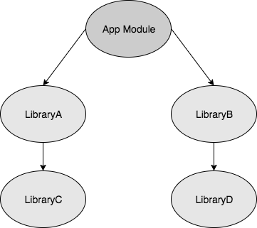
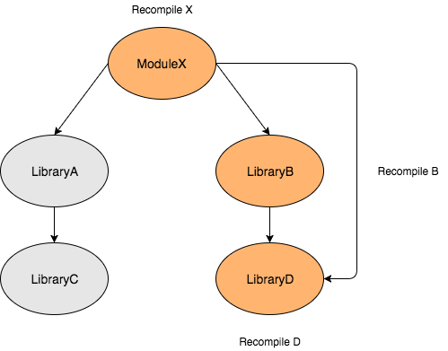
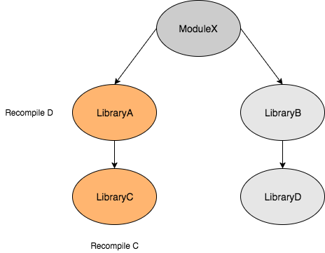

### api & implementation

项目结构如下



AppModule: 

```groovy
api project(":LibB")
implementation project(":LibA")
```

LibB:

```groovy
api project(":LibD")
```

LibA:

```groovy
implementation project(":LibC")
```


区别如下：

`api`依赖：`LibD`有改动的编译




`implementation`依赖：`LibC`有改动的编译

